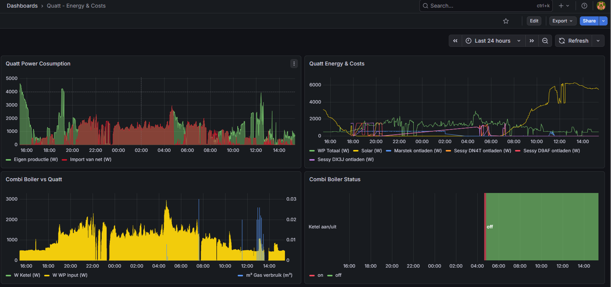

# Quatt - Energy & Costs

Dashboard showing the energy consumption of the Quatt Hybrid Duo heat pump, the contribution of solar and batteries, boiler activity and gas usage.

## Panels

### Quatt Power Consumption
Self-sufficiency view showing:
- **Eigen productie (W)** — how much of the heat pump's consumption is covered by own generation (solar + batteries)
- **Import van net (W)** — how much is drawn from the grid

Calculated using P1 meter as ground truth: if P1 is positive (importing), the grid portion of heat pump consumption is determined proportionally.

### Quatt Energy & Costs
Stacked view of energy sources feeding the heat pump:
- Total heat pump consumption (W)
- Solar production (W)
- Marstek discharge (W)
- Sessy DN4T, D9AF, DX3J discharge (W)

### Combi Boiler vs Quatt
Comparison of heat output sources:
- Boiler heat power (W)
- Heat pump power input (W)
- Gas consumption (m³) on right Y-axis — derived using `difference()` on the cumulative P1 gas meter

Shows when the hybrid system switches between heat pump and gas boiler.

### Combi Boiler Status
State timeline showing boiler on/off status:
- 🟢 Green = boiler off (heat pump handling load)
- 🔴 Red = boiler active (supplementing or taking over)

## Required Sensors

| Sensor | Integration |
|--------|-------------|
| `sensor.cic_total_power_input` | Quatt |
| `sensor.boiler_heat_power` | Quatt |
| `binary_sensor.boiler_cic_on_off_mode` | Quatt |
| `sensor.p1_meter_3c39e72bdf42_active_power` | DSMR/P1 |
| `sensor.p1_meter_3c39e72bdf42_total_gas` | DSMR/P1 |
| `sensor.envoy_122149071873_current_power_production` | Enphase Envoy |
| `sensor.marstek_venus_modbus_battery_power` | Marstek Venus Modbus |
| `sensor.sessy_dn4t_power` | Sessy |
| `sensor.sessy_d9af_power` | Sessy |
| `sensor.sessy_dx3j_power` | Sessy |

## Setup Notes

The Quatt Hybrid Duo automatically switches between the heat pump and gas boiler based on outdoor temperature and efficiency. This dashboard lets you see exactly when and how long the boiler runs, and how much of the heat pump's electricity comes from your own generation vs the grid.

The self-sufficiency calculation uses the P1 meter as ground truth rather than summing individual sources, which avoids accumulation errors from sparse sensor data.
