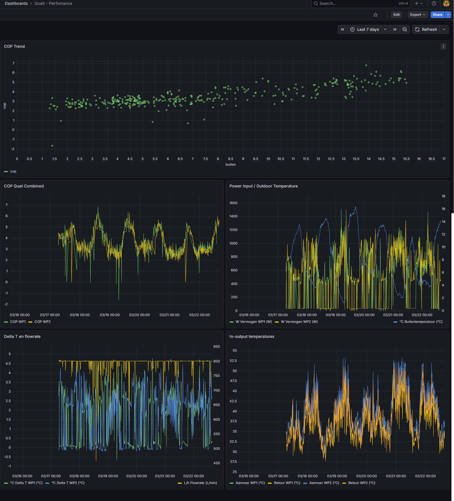

# Quatt - Performance

Technical performance dashboard for the Quatt Hybrid Duo heat pump. Shows COP trends, water temperatures, flow rate and power input for both heat pump units.

## Panels

### COP Trend
Scatter plot showing COP (Coefficient of Performance) vs outdoor temperature. Each dot represents a 15-minute average. Shows the direct correlation between outdoor temperature and heat pump efficiency — the warmer it is outside, the higher the COP.

Use this to:
- Validate that your heat pump is performing within spec
- Identify periods of unusually low COP (possible short cycling or defrost)
- Compare seasonal performance

### COP Quat Combined
Time series of COP for both heat pump units over time. A healthy system should show COP values between 2.5 and 6 depending on outdoor temperature. Spikes above 8 are typically measurement artifacts at very low load.

### Power Input / Outdoor Temperature
- WP1 and WP2 power input (W) on left Y-axis
- Outdoor (feels like) temperature (°C) on right Y-axis

Shows the inverse relationship between outdoor temperature and power consumption — as it gets warmer, the heat pump uses less electricity for the same heat output.

### Delta T en flowrate
- Delta T WP1 and WP2 (°C) — temperature difference between water in and water out
- Flow rate (L/h) on right Y-axis

Delta T of 3-5°C is typical for a low-temperature system with underfloor heating or low-temp radiators. Very low delta T (<1°C) may indicate flow issues or short cycling.

### In-output temperatures
All four water temperatures:
- Aanvoer WP1 (flow temperature unit 1)
- Retour WP1 (return temperature unit 1)
- Aanvoer WP2 (flow temperature unit 2)
- Retour WP2 (return temperature unit 2)

The flow temperature should follow the heating curve — dropping as outdoor temperature rises. Typical range: 28°C (warm day) to 52°C (cold day).

## Required Sensors

| Sensor | Integration |
|--------|-------------|
| `sensor.heatpump_1_quatt_cop` | Quatt |
| `sensor.heatpump_2_quatt_cop` | Quatt |
| `sensor.heatpump_1_power_input` | Quatt |
| `sensor.heatpump_2_power_input` | Quatt |
| `sensor.heatpump_1_temperature_water_in` | Quatt |
| `sensor.heatpump_2_temperature_water_in` | Quatt |
| `sensor.heatpump_1_temperature_water_out` | Quatt |
| `sensor.heatpump_2_temperature_water_out` | Quatt |
| `sensor.heatpump_1_water_delta` | Quatt |
| `sensor.heatpump_2_water_delta` | Quatt |
| `sensor.flowmeter_flowrate` | Quatt |
| `sensor.flowmeter_temperature` | Quatt |
| `sensor.ws2900_v2_01_18_feels_like_temperature` | Ecowitt WS2900 |

## Setup Notes

This dashboard uses a **Quatt Hybrid Duo** with two heat pump units (WP1 and WP2) running in parallel. If you have a single unit setup, simply hide or remove the WP2 queries.

The COP scatter plot uses the XY Chart panel type, available in Grafana 10+.

### Polling Intervals
The Quatt integration supports configurable polling intervals:
- High priority: 10s (power, temperatures)
- Medium priority: 30s
- Low priority: 60s
- Very low priority: 180s

Higher polling frequency gives more accurate COP calculations and smoother graphs.
